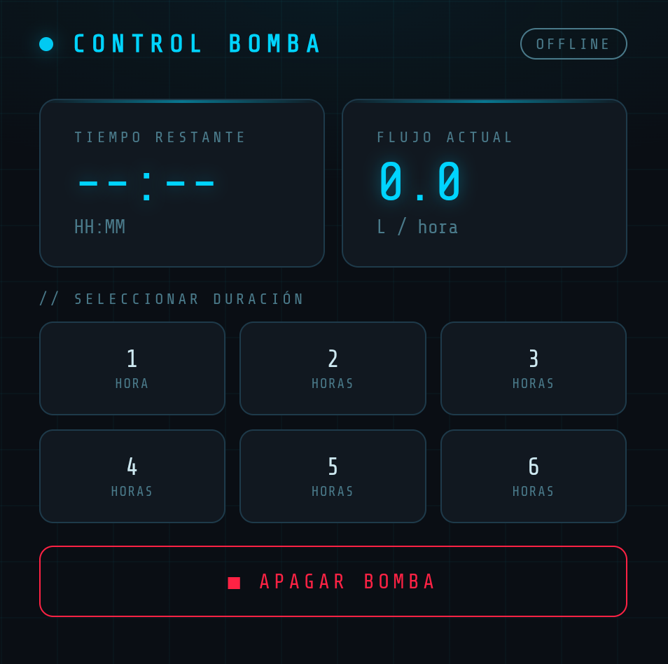

# water-pump-timer-esp32

An ESP32-based automatic timer to control a water pump. You select a duration between 1 and 6 hours, and the device turns the pump off automatically when the time is up. A `MAX_HOURS_TIMER` constant is available in the code if you need to extend the maximum duration (currently set to 6 hours).

The project was built to fill a water reservoir tank that takes roughly 6 hours to fill. Because the pump runs unattended, the device also hosts a web server so the pump can be monitored and controlled remotely. The web interface includes a live water flow reading, useful for knowing whether water is actually moving when you are not around. Adding an automatic shutoff triggered by zero flow is possible with a small code change, but was not needed for this use case.

---

## Images

<p align="center">
  
  &nbsp;&nbsp;&nbsp;
  
</p>

## Hardware

| Component | Notes |
|---|---|
| ESP32 | Main microcontroller |
| 3× Push buttons with ring LED backlight | Each button has an integrated LED that blinks to reflect the current device state |
| SSD1306 OLED display | Shows timer and remaining time |
| IR proximity sensor | Wakes the display when a hand gets close, preventing OLED burn-in |
| Power indicator LED | Always-on LED showing the device is live |
| YF-S201 water flow sensor | Measures flow in litres per hour via pulse counting |
| Relay module (Normally Open) | Switches the pump on and off |

### Protection circuits

**Relay driver — optocoupler circuit**
The relay is driven through an optocoupler to electrically isolate the ESP32 from the relay coil.

**Relay — snubber circuit**
A 100 Ω ½ W resistor in series with a 0.1 µF 250 V polyester capacitor is connected across the relay's COM and NO pins. This suppresses the voltage spike produced when the relay opens under load, protecting the ESP32 from transient interference.

**Power supply — decoupling capacitors**
A 1000 µF electrolytic capacitor in parallel with a 0.1 µF ceramic capacitor is connected between the 5 V and GND rails. This combination filters both low-frequency and high-frequency noise on the supply line, preventing the ESP32 from browning out or resetting when the relay switches.

---

## Pin map

| Pin | Assignment |
|---|---|
| 16 | OFF button |
| 17 | SELECTOR button |
| 5 | OK button |
| 15 | OFF button LED |
| 2 | SELECTOR button LED |
| 4 | OK button LED |
| 19 | Power indicator LED |
| 18 | IR sensor |
| 23 | Relay |
| 25 | YF-S201 flow sensor |

---

## How it works

### Physical controls

Three buttons control the device:

- **SELECTOR** — cycles through the available durations (1 → 2 → … → `MAX_HOURS_TIMER` hours) while the pump is off.
- **OK** — starts the pump for the selected duration.
- **OFF** — stops the pump immediately at any time.

Each button's ring LED blinks or stays lit in patterns that reflect the current state, so the device status is readable at a glance without looking at the screen.

### OLED display

The display shows the selected duration while in standby, and the remaining time (`HH:MM`) while the pump is running. It is driven by the IR sensor: it turns on when a hand is detected nearby and switches off after 30 seconds of inactivity, preventing burn-in on the OLED panel.

### Web interface

The ESP32 connects to your WiFi network on boot and prints its IP address to Serial. Open that address in a browser to access the control panel. The interface replicates the physical buttons and additionally shows live flow rate data that is not displayed on the OLED.

---

## Key functions

### `flowISR()`
An Interrupt Service Routine that runs automatically on every rising pulse from the YF-S201 sensor. It simply increments a counter. The `IRAM_ATTR` attribute places it in internal RAM so it executes reliably without flash access delays.

### `updateFlowRate()`
Called every loop, it calculates litres per hour once per second from the pulse count using the YF-S201 formula (`L/hour = pulses × 60 / 7.5`). The counter is read and reset inside a `noInterrupts()` / `interrupts()` block to prevent a race condition with the ISR.

### `handleRelay()`
Arms the relay and starts the countdown when `modeIndicator` transitions to `ON`. On each subsequent loop it checks whether the elapsed time has reached the configured duration, and if so cuts the relay and returns the device to the `OFF` state.

### `handleDisplay()`
Manages the OLED. The IR sensor triggers a 30-second active window; outside that window the display is blanked. While active, it renders either the hour selector or a live countdown depending on the current state.

### `handleStates()`
Controls the button ring LEDs to provide visual state feedback without blocking the main loop. It uses `esp_timer_get_time()` for non-blocking millisecond timing so the LEDs blink independently of any `delay()` calls elsewhere.

### `readButtons()`
Reads the three debounced physical buttons using the Bounce2 library and updates `modeIndicator` and `hourIndicator` accordingly.

### Web server routes

| Route | Behaviour |
|---|---|
| `GET /` | Serves the control page |
| `GET /set?hours=N` | Starts the relay for N hours |
| `GET /off` | Stops the relay immediately |
| `GET /status` | Returns JSON with current mode, remaining seconds, and flow rate — polled every second by the page |

---

## Files

- **`timer_v2.ino`** — the complete firmware. The HTML/CSS/JS for the web interface is embedded in this file as a `PROGMEM` string and served directly by the ESP32. No separate file is needed on any server.
- **`index.html`** — a standalone copy of the web interface included for reference. You do not need it to run the project.

---

## Setup

1. Open `timer_v2.ino` in the Arduino IDE with ESP32 board support installed.
2. Set your WiFi credentials at the top of the file:
   ```cpp
   const char* ssid     = "YOUR_SSID";
   const char* password = "YOUR_PASSWORD";
   ```
3. Adjust `MAX_HOURS_TIMER` if you need a longer maximum duration.
4. Flash to your ESP32. The assigned IP address will appear in the Serial monitor at 9600 baud.
5. Open that IP address in a browser on the same network.

---

## Dependencies

- [Adafruit SSD1306](https://github.com/adafruit/Adafruit_SSD1306)
- [Adafruit GFX](https://github.com/adafruit/Adafruit-GFX-Library)
- [Bounce2](https://github.com/thomasfredericks/Bounce2)
- ESP32 Arduino core (includes `WiFi.h`, `WebServer.h`, `esp_timer.h`)
